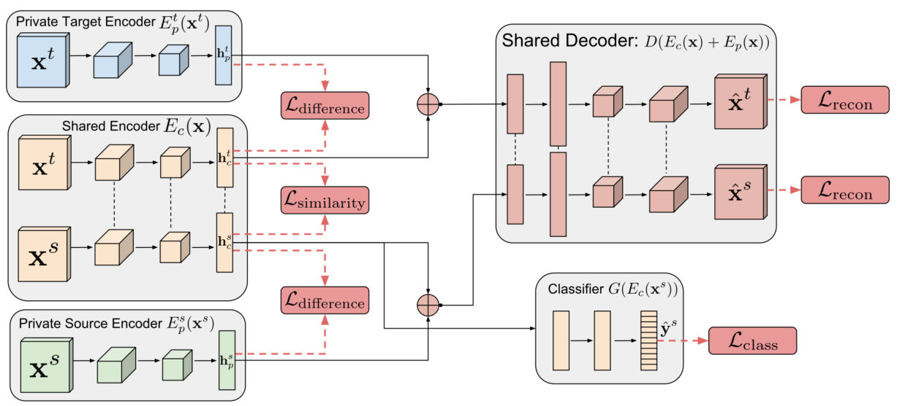

This is a Pytorch implementation of the Domain Separation Network [Arxiv](https://arxiv.org/abs/1608.06019). There have been multiple implementations of this article on GitHub, but most of them are based on TensorFlow with poor readability. The few PyTorch-based implementations have extremely brief documentation, making it difficult to start training and reproduce the metrics in the paper. This project provides a PyTorch implementation with clear steps, facilitating everyone to reproduce the results.

## Environment
- numpy                1.21.5
- protobuf             3.20.0
- scikit-image         0.19.3
- tensorboard          1.15.0
- tensorflow           1.15.0
- tensorflow-estimator 1.15.1
- torch                1.12.1
- torchvision          0.13.1

## Network Structure

## Usage
Generate training and testing datasets.

`python create_mnistm.py`

Start Training.

`python model.py`

**Note that this model is very sensitive to the batch_size, our implementation cannot perform as perfect as the
original paper, so be careful when you tune parameters for other datasets.** 

## Result

We only conduct the experiments from mnist to mnist_m, the target accuracy of our implementation is about 86% (original
paper ~83%).
